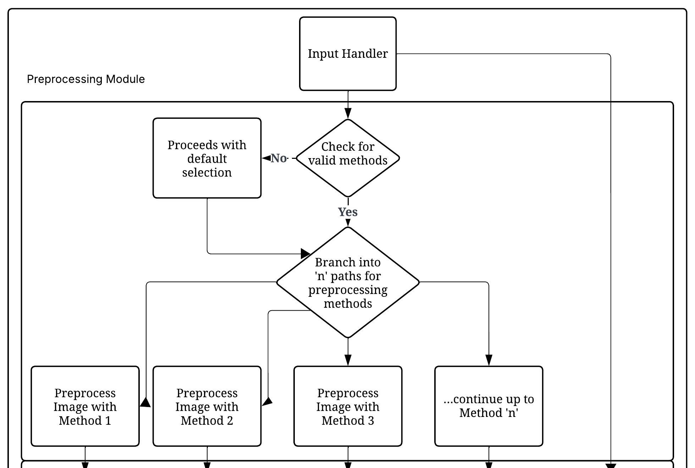
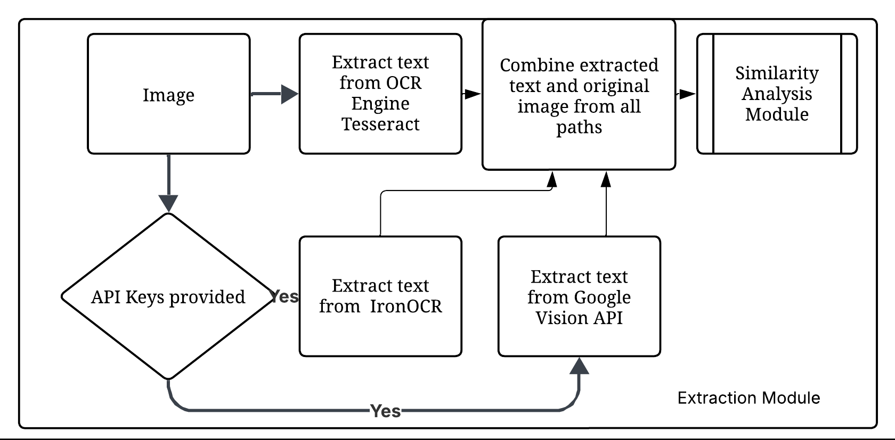
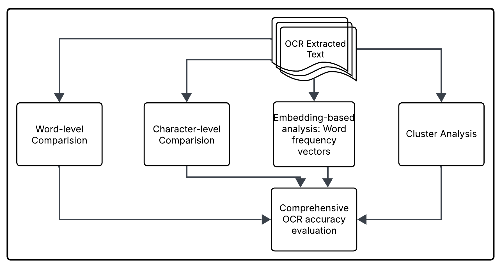
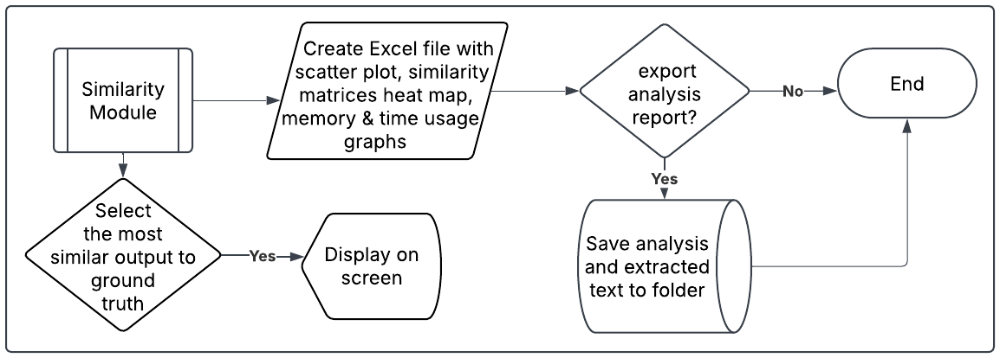
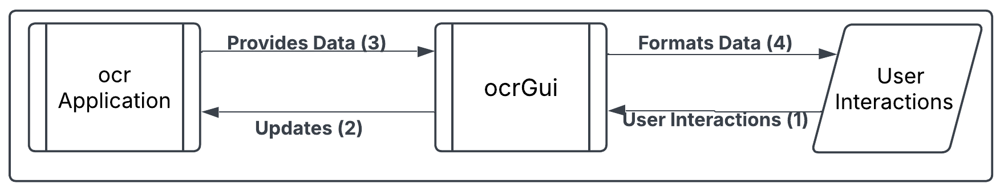

#  Architecture

## ocrApplication

The architectural flow diagram of the application is provided below:


This diagram illustrates the complete workflow of the OCR application, showing how image input is processed through preprocessing modules, fed into OCR engines, and how the extracted text results are analyzed, compared and visualized. The diagram shows data flow between components including input handling, image preprocessing, OCR extraction, text similarity analysis, and result export modules.

The core OCR processing engine consists of the following key components:

### Input Handling

The [`InputHandler`](../../ocrApplication/InputHandler.cs) class manages the first stage of the OCR pipeline as shown in the architecture diagram. It's responsible for loading images from specified locations, creating output directories, and loading selected preprocessing techniques. This component serves as the entry point for all data into the system.

```csharp
public static class InputHandler
{
    // Prompts the user for a valid folder path, ensuring that the input is not empty or whitespace.
    public static string GetFolderPath(string promptMessage) { /* ... */ }
    
    // Discovers all image files in a specified folder and its subfolders.
    public static string[] DiscoverImageFiles(string inputFolderPath)  { /* ... */ }
    
    // Prompts the user to select preprocessing methods to apply from the available options.
    public static List<(string Name, Func<string, Mat> Method)> SelectPreprocessingMethods(
            (string Name, Func<string, Mat> Method)[] allPreprocessMethods)  { /* ... */ }
    
}
```

The InputHandler class is responsible for managing user inputs, processing file directories, and applying preprocessing techniques to images before performing Optical Character Recognition (OCR). Below are the key methods in the class:

**GetFolderPath**
This method ensures that the user inputs a valid path to a folder containing image files. It validates whether the provided path exists and checks if it contains the appropriate image files. If the path is invalid or inaccessible, the method prompts the user to provide a correct one, ensuring that further processing only occurs with valid input.

**DiscoverImageFiles**
This method scans a specified directory to discover all image files in supported formats (e.g., .jpg, .png, .tiff). It allows the program to gather and list all images in the directory, which will be processed for OCR. This is helpful for batch processing when dealing with multiple images in a folder.

**SelectPreprocessingMethods**
Before applying OCR, it is important to enhance the image quality for better recognition accuracy. This method enables users to choose from a list of preprocessing techniques (e.g., noise reduction, resizing, contrast enhancement) to apply to the images. By offering flexibility in preprocessing, this method ensures that users can optimize image quality according to their specific needs, improving the overall OCR results.

### Image Preprocessing

The [`ImagePreprocessing`](../../ocrApplication/ImagePreprocessing.cs) class implements the preprocessing module shown in the architecture diagram. This critical component applies various image enhancement techniques to improve OCR accuracy by normalizing image quality, removing artifacts, and enhancing text features before OCR processing.

The image processing module architecture is described below:



The preprocessing module addresses various image quality challenges that can impact OCR accuracy. It implements 24 distinct image enhancement techniques, organized into five functional categories:

- **Noise Reduction**: Techniques to reduce noise and improve image clarity, including Gaussian filtering, median filtering, and bilateral filtering.

- **Binarization: Methods** to convert images to binary form, such as Otsu's method and adaptive thresholding.

- **Geometric Transformations**: Image adjustments like deskewing, rotation, and scaling to correct distortions.

- **Morphological Operations**: Operations to refine image structure, including dilation, erosion, opening, closing, gradient, top-hat, and black-hat.

- **Intensity Adjustments**: Enhancements to image intensity, including gamma correction, histogram equalization, contrast stretching, and brightness reduction.

These techniques are designed to optimize image quality, improving OCR performance and accuracy.


### OCR Integration Engine

The extraction module containg various OCR Engines is described as follows

This component utilizes a multi-engine strategy for text extraction, offering flexibility and improved accuracy through the following integrations:

**Tesseract OCR**: A locally-running OCR engine that supports a wide range of languages, providing an offline solution for text extraction.

**Google Cloud Vision API**: A cloud-based OCR service with advanced recognition capabilities, leveraging Google's powerful machine learning models for improved accuracy.

**IronOCR**: A powerful OCR library for .NET, providing fast and accurate text extraction from images and PDFs with support for multiple languages.

The system allows users to compare results from all three OCR engines, leveraging an ensemble approach to generate more accurate synthetic ground truth data.

*Note: The integration for IronOCR and Google Cloud Vision API is currently commented out. Once the appropriate API keys are provided, the relevant sections of the code can be uncommented to enable these engines.*

The [`OcrExtractionTools`](../../ocrApplication/OcrExtractionTools.cs) class represents the OCR engine integration component in the architecture diagram. This module interfaces with multiple OCR engines to extract text from preprocessed images.

```csharp
public class OcrExtractionTools
{
    // Extract text using Tesseract
    public string ExtractTextWithTesseract(string imagePath) { /* ... */ }
    
    // Extract text using Tesseract Nuget Package
    public async Task<string> ExtractTextWithTesseractNuget(string imagePath) { /* ... */ }

    // Extracts text using IronOCR commercial library.
    public string ExtractTextUsingIronOcr(string imagePath) { /* ... */}

   // Extracts text using Google Cloud Vision API.
   public async Task<string> ExtractTextUsingGoogleVisionAsync(string imagePath) { /* ... */}
}
```

### Similarity Analysis

The text comparision and similarity module archuitecture is described below:


The [`TextSimilarity`](../../ocrApplication/OcrComparision.cs) class provides a set of methods for comparing and analyzing the similarity between two text strings. It implements several text comparison techniques, each of which calculates similarity based on different algorithms. The class includes the following methods:

```csharp
public class OcrComparison
{
    // Calculates Levenshtein similarity
    public double CalculateLevenshteinSimilarity(string text1, string text2) { /* ... */ }
    
    // Calculates cosine similarity
    public double CalculateCosineSimilarity(string text1, string text2) { /* ... */ }
    
    // Generate word vectors for comparison
    public Dictionary<string, double> GetWordVector(string text) { /* ... */ }

    // Calculates Jaccard similarity
    public float CalculateJaccardSimilarity(string text1, string text2)
        { /* ... */ }

    // Calculates Jaro-Winkler similarity
    public float CalculateJaroSimilarity(string s1, string s2)
        { /* ... */ }
}
```

The Similarity Analysis Module leverages multiple text similarity metrics and embedding techniques to evaluate OCR accuracy comprehensively. This module allows for a detailed comparison of OCR outputs, ensuring the system can assess recognition quality from various perspectives. The following metrics and techniques are implemented:

**Character-level metrics**

- Levenshtein Distance: Measures the minimum number of character edits (insertions, deletions, substitutions) required to transform one string into another.

- Jaro-Winkler Similarity: A string comparison algorithm that focuses on matching characters while accounting for transpositions.

**Word-level metrics**

- Cosine Similarity: Measures the cosine of the angle between two word vectors, useful for comparing documents based on word frequency distributions.

- Jaccard Similarity: Calculates the ratio of the intersection over the union of two sets (e.g., sets of words), assessing the overlap between texts.

**Embedding-based analysis**

Word Frequency Vectors: Represents each word in a text as a vector, with the frequency of occurrence providing weight.

**Cluster-based analysis**

This technique extracts features from images (e.g., visual characteristics) and groups similar images into clusters. This is useful for identifying patterns, organizing OCR outputs, and grouping similar documents or pages.

**Visual Characteristics for Feature Extraction**

The following visual attributes are extracted to assess OCR accuracy:

1) Intensity Distribution: Mean and standard deviation of pixel intensities.
2) Edge Density: Quantified using Canny edge detection.
3) Aspect Ratio and Normalized Dimensions: Shape characteristics to detect distortions.
4) Noise Characteristics: Evaluated using local variance analysis.
5) Contrast Levels: Measured through histogram analysis and contrast stretch ratios.

These techniques combine to form a robust analysis toolkit for comparing OCR results and generating a more accurate evaluation of OCR accuracy and quality.


### Visualization

The Visualization Module as described in the below figure is designed to provide visual representations of text similarity and facilitate the export of OCR results for reporting and analysis. 


This module includes the following key classes and methods:

**SimilarityMatrixGenerator Class**

The [`SimilarityMatrixGenerator`](../../ocrApplication/TextSimilarity.cs) class creates visual representations of text similarity:

```csharp
public class SimilarityMatrixGenerator
{
    // Generate text embeddings for visualization
    public List<TextEmbedding> GenerateTextEmbeddings(List<string> texts, List<string> labels) { /* ... */ }
    
    // Create similarity heatmap
    public async Task GenerateAndVisualizeOcrSimilarityMatrix(
        List<string> ocrResults, 
        string groundTruth, 
        string outputFilePath, 
        List<string> ocrSteps) { /* ... */ }
}
```

The SimilarityMatrixGenerator class is responsible for creating visual representations of text similarity. It generates embeddings and visualizes similarity metrics to help analyze and compare OCR outputs against the ground truth. The key methods in this class are:

1) GenerateTextEmbeddings: This method generates text embeddings for a given list of texts, which are used for visualizing the similarity between different text entries. The embeddings are accompanied by corresponding labels, making it easier to interpret the results.
2) GenerateAndVisualizeOcrSimilarityMatrix: This asynchronous method creates a similarity heatmap by comparing OCR results with the ground truth. It visualizes the degree of similarity between OCR outputs and provides a useful way to assess how well different OCR results match the expected text. The heatmap is saved as an excel file at the specified outputFilePath.

These methods help in generating a visual matrix that allows for easy comparison and analysis of OCR accuracy.

**Export Utilities**

The [`ExportUtilities`](../../ocrApplication/ExportUtilities.cs) class provides functionality for exporting synthetic ground truth text and OCR results in multiple file formats. This allows users to save and share their results for further analysis or reporting. The key method in this class is:

```csharp
public static class ExportUtilities
{
   // Exports complete OCR results to multiple file formats, including best methods summaries.
   public static void ExportResults(
               string outputPath, 
               ConcurrentDictionary<string, string> extractedTexts,
               ConcurrentDictionary<string, string> bestCosineMethods,
               ConcurrentDictionary<string, string> bestLevenshteinMethods,
               ConcurrentDictionary<string, string> bestClusteringMethods,
               Dictionary<string, string> overallBestMethods){ /* ... */ }
}
        
```

ExportResults: This method exports the complete OCR results to various file formats, including .txt and .pdf. It allows for the export of OCR outputs along with method summaries, such as:

1) Best Cosine Methods: Best OCR methods based on cosine similarity.
2) Best Levenshtein Methods: Best OCR methods based on Levenshtein distance.
3) Best Clustering Methods: Best methods based on clustering results.
4) Overall Best Methods: A summary of the overall best-performing OCR methods.

Key methods:

- **ExportToPlainText**: Exports OCR text to a .txt file.
- **ExportToPdf**: Exports OCR text to a formatted PDF.
- **ExportBestMethodsSummary**: Exports a detailed analysis of the best methods to text, PDF, and Excel.

By utilizing this method, users can export results and summaries of their OCR comparison to share, review, or document their findings.

## ocrGui

OCRGui is a graphical user interface designed to facilitate Optical Character Recognition (OCR) tasks by interacting with the underlying ocrApplication. It allows users to provide necessary inputs, validate them, and process them through OCR. The results are then displayed, or users are prompted to correct any errors.

The following flowchart describes the workflow of ocrGui, a graphical user interface (GUI) designed for handling OCR (Optical Character Recognition) processing by interacting with an underlying ocrApplication.



*This diagram shows the GUI component workflow, illustrating how user interactions are processed through the Avalonia UI framework. It demonstrates the flow from user input capture, through the MVVM architecture components, to the rendering of results and visualizations in the interface.*

The **MVVM (Model-View-ViewModel) architecture** separates the application into three distinct components, improving maintainability and testability:

- **Model**: Represents the data and business logic. It handles tasks like image processing and OCR without any direct interaction with the UI.

- **View**: The user interface that displays data and captures user interactions. It’s responsible for presenting the results and doesn’t contain any logic for data manipulation.

- **ViewModel**: Acts as a mediator between the Model and View. It provides data from the Model in a format the View can display and handles user interactions to update the Model.

This separation allows for a more organized, modular approach to development, making the application easier to maintain and extend.

In the .NET MAUI application, the main page and window are crucial for user interaction. This section provides an overview of how the main page and window are configured in the application.

### App.axaml

The App.xaml file is the entry point of the application, which defines the primary page and initializes the application resources. In Avalonia, the first page presented when running the app is defined in this file. It holds the configuration for the main application window, making it central to window management and lifecycle. Below is the code responsible for setting up the application:
```csharp
public class App : Application
{
   // Initializes the application by loading XAML resources.
    public override void Initialize()
        {
            AvaloniaXamlLoader.Load(this);
        }

   // This is where we create the main window instance and assign it to the desktop application lifetime. This ensures proper window management and lifecycle.
   public override void OnFrameworkInitializationCompleted()
        {
            if (ApplicationLifetime is IClassicDesktopStyleApplicationLifetime desktop)
            {
                // Create the main window for the application
                desktop.MainWindow = new MainWindow();
            }

            base.OnFrameworkInitializationCompleted();
        }
}
```

- **Initialize()**: This method loads the XAML resources required for the application. It prepares the UI and resources, like styles and themes, that are defined in XAML.

- **OnFrameworkInitializationCompleted()**: This method runs when the application is initialized. It checks if the application is running in a desktop environment (IClassicDesktopStyleApplicationLifetime) and assigns the main window (MainWindow) to the desktop application. This ensures the main window is managed properly and is the first window users see.

### Main Window

The [`MainWindow.axaml.cs`](../../ocrGui/MainWindow.axaml.cs) file is where the main window of the application is created and configured. It contains the code that sets up the window instance, handles UI interactions, and ensures proper initialization of the window during the application's lifetime.
```csharp
public partial class MainWindow : Window
{
   // This is where we create the main window instance and assign it to the desktop application lifetime. This ensures proper window management and lifecycle.
   public MainWindow(){ /*  ... */ }
}
```

- MainWindow(): The constructor for the MainWindow class initializes the window's components and performs any necessary configuration. This is where any window-specific settings, such as title, size, or content layout, can be set up.

To summarise the working of GUI Application

- **App.axaml** initializes the application, loading resources and defining the primary page.

- **OnFrameworkInitializationCompleted()** assigns the main window to the desktop application, ensuring proper window management.

- **MainWindow.axaml.cs** is where the main application window is configured, providing the user interface for interacting with the app.

[Back to Home](../../readme.md)