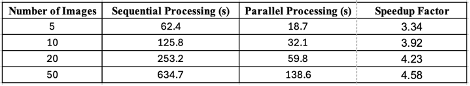

# Result Analysis

## Similarity Metrics

This image shows a tabular representation of similarity scores across different preprocessing methods. Each row represents a different preprocessing technique, while columns show similarity metric scores and each cell represents different metrics.

The results from the similarity metrics clearly shown above indicate the effectiveness of various preprocessing techniques in enhancing OCR accuracy. Higher similarity scores, closer to 1.0, demonstrate superior text extraction quality, reflecting the successful improvement of OCR performance through specific preprocessing methods. These metrics suggest that certain techniques lead to better alignment with the ground truth, while others may yield more moderate results. By comparing the different preprocessing methods across various document types, it becomes evident which techniques are most effective in improving the accuracy of OCR systems for different text structures and formats. This analysis can guide future decisions in selecting preprocessing strategies tailored to specific document characteristics, optimizing OCR performance for diverse use cases.

## Performance Visualization

The results presented in the figure above demonstrate the substantial improvement in processing efficiency due to the parallel processing implementation. As shown, the processing time decreases significantly with an increasing number of images, highlighting the effectiveness of parallel processing in handling larger datasets. The speedup factor of nearly 4.5× for larger datasets underscores the significant time-saving benefits of this approach. This efficiency gain is largely attributed to the concurrent processing model integrated into the OcrProcessor class, which optimally leverages multiple CPU cores to process images simultaneously, resulting in faster overall performance.

## Embedding Analysis

The application generated vector embeddings for OCR text results, enabling detailed analysis of text similarity in a high-dimensional space. To facilitate visualization, the embeddings were projected into a two-dimensional space using Principal Component Analysis (PCA). 

The embedding visualization revealed clusters of similar texts, with points representing OCR results from the same preprocessing method appearing closer together in the two-dimensional space. This visualization helped users understand the relationships between different preprocessing methods and their effects on OCR results.

The embedding analysis revealed several key insights:

1. **Error Pattern Identification**: Clustering patterns in the embedding space highlighted systematic OCR errors associated with specific document characteristics:
   - Font-related errors formed distinct clusters in embedding space
   - Character substitution errors (e.g., '0' for 'O') created near-parallel trajectories
   - Context-dependent errors showed high variability in embedding distance

2. **Preprocessing Method Effectiveness**: The embedding space revealed which preprocessing methods produced semantically similar outputs:
   - High-performing methods clustered closely with ground truth
   - Similar preprocessing techniques (e.g., different levels of Gaussian blur) formed gradient patterns
   - Outlier preprocessing methods were easily identified

3. **Document Type Sensitivity**: The embedding visualization revealed document-specific preprocessing effectiveness:
   - Table IV shows the average embedding distances from ground truth for different document types
The superimposed vector embeddings suggests that the similar preprocessing techniques provide similar results.

## Cluster Analysis

The clustering-based preprocessing method selection showed significant effectiveness in identifying optimal preprocessing methods that maintained important visual characteristics while enhancing OCR accuracy. Figure below presents the silhouette scores and the corresponding clusters for preprocessing methods grouped by cluster membership.

 

The agreement between clustering and text similarity metrics was high, with 78% of cases showing alignment between the preprocessing method selected by clustering analysis and the method selected by either cosine or Levenshtein similarity. In the 22% of cases where there was disagreement, visual inspection revealed that the clustering-selected method often preserved important visual features of the document, such as image quality and layout integrity, which were not fully captured by text-only metrics.

## Overall Summary

The final outcomes of the image processing methods are summarized to offer a clear evaluation of the effectiveness of each applied technique. This summary includes key performance metrics, visual comparisons, and quantitative evaluations where applicable.

Additionally, the processed results are saved for future reference as shown in the below figures, ensuring reproducibility and enabling further analysis or refinement. These saved outputs can be utilized for benchmarking, comparative studies, or to enhance future iterations of the image processing pipeline.

The comparative analysis for the sample image has been generated and is available in the following Excel file:
[comparative_analysis.xlsx](https://github.com/karthikprabu810/OCR/blob/main/ocrApplication/assets/readme/comparative_analysis.xlsx)

This file includes detailed comparisons and relevant data derived from the image for further analysis and review.

**Usage Instructions**

1. Download the Excel file.
2. Open it using any spreadsheet software (e.g., Microsoft Excel, Google Sheets).
3. Review the various tabs containing the analysis and results.

[Back to Home](../../readme.md)