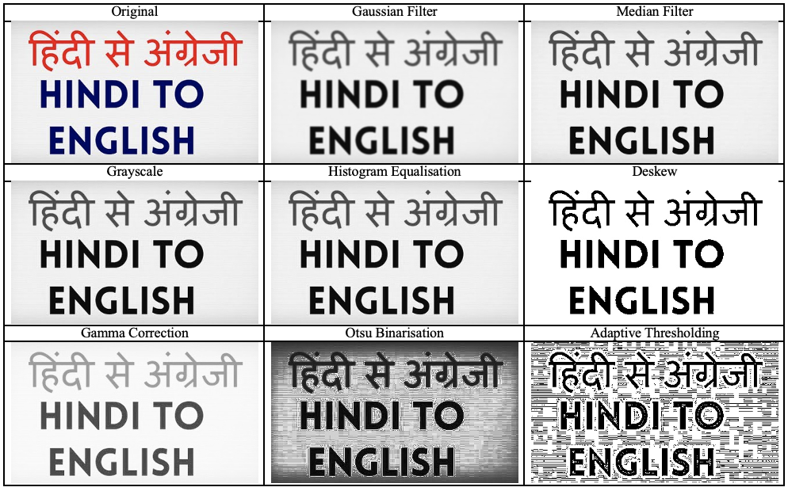
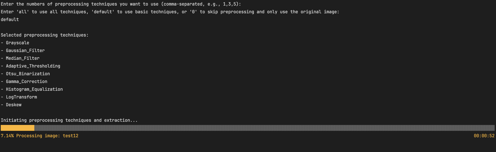
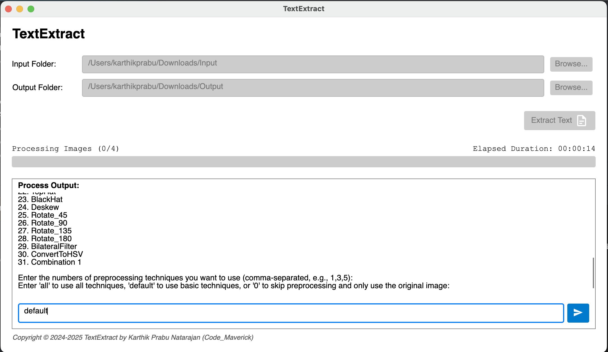
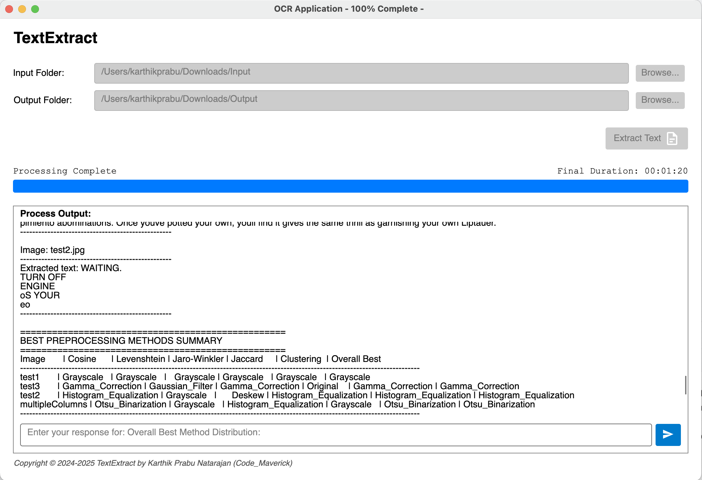

# Visualisation

Below is a sample image after basic preprocessing techniques:

This image showcases the result of applying fundamental preprocessing methods to enhance the data quality for further analysis. The adjustments made improve clarity and make key features more prominent for accurate comparisons.

## User Interface 

The application provides two modes of interaction for users: the Command Line Interface (CLI) and the Graphical User Interface (GUI). Both interfaces allow users to specify input folders, process images using OCR techniques, and view or save the extracted text. The choice of interface depends on user preference and the desired level of interaction, with the CLI offering a streamlined, text-based approach and the GUI providing a more visual, user-friendly experience. Each interface is designed to ensure smooth processing and efficient access to OCR results.

**Command Line Interface Screen**

In the CLI version, users specify folder names by entering paths as command-line arguments or providing inputs interactively. The application then processes the images within the specified folders, extracting text using OCR techniques.

During the processing, a progress bar is shown to keep the user updated on the current status and estimated completion time. Once the processing is complete, the extracted text is displayed in the terminal for immediate review. Additionally, users have the option to save the results to a file for future reference, ensuring easy access for further analysis or follow-up actions.

**Graphical User Interface Screen**

The user inputs the folder names through the GUI, either by typing the path or selecting folders via a browse dialog. Once the folders are specified, the application processes the images and extracts text using OCR techniques. After processing is complete, the extracted text is displayed directly in the GUI, allowing the user to review the results. Users can easily save the extracted text to a file for future reference or further analysis. Additionally, the interface provides an intuitive and user-friendly experience, ensuring smooth navigation and efficient access to the OCR results.

 

[Back to Home](../../readme.md)