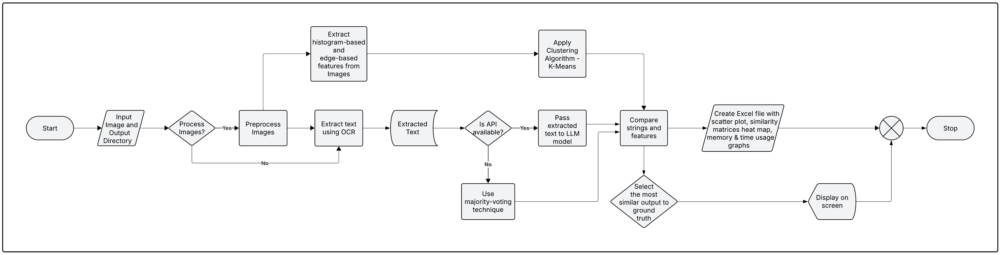
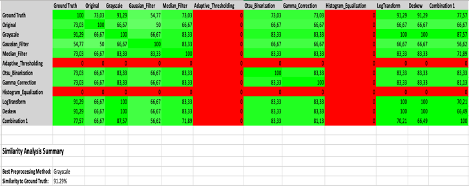
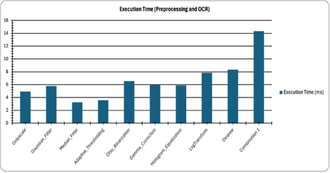
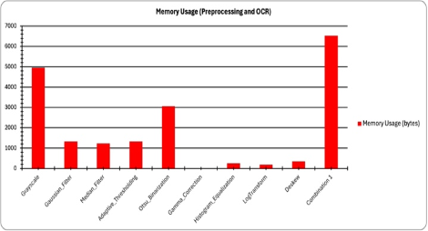

# ML 24/25-10 Creating Text from images with OCR API

The OCR Application Suite is a comprehensive solution for extracting and analyzing text from images. Built with advanced image preprocessing techniques and sophisticated text analysis algorithms, this suite aims to provide synthetic ground truth through majority voting approach and visualise the comparision results.

The application is designed for researchers, data scientists, and professionals who need to extract text from images with high accuracy, especially in scenarios where traditional OCR solutions struggle, such as with poor quality images, diverse fonts, or mixed languages.

<a name="top"></a>

## Table of Contents
1. [Goal of the Experiment](#goal-of-the-experiment)
2. [Features](#features)
3. [Components](#components)
   - [ocrApplication](#ocrapplication)
   - [ocrGui](#ocrgui)
   - [unitTestProject](#unittestproject)
4. [System Requirements](#system-requirements)
5. [Installation](#installation)
   - [Prerequisites](#prerequisites)
   - [Setup Steps](#setup-steps)
   - [Configuration](#configuration)
   - [Language Data Files](#language-data-files)
6. [Usage](#usage)
   - [Command Line Interface](#command-line-interface)
   - [Graphical User Interface](#graphical-user-interface)
7. [Testing](#testing)
8. [Architecture](#architecture)
   - [ocrApplication](#ocrapplication-1)
      - [Input Handling](#input-handling)
      - [Image Preprocessing](#image-preprocessing)
      - [OCR Extraction](#ocr-extraction)
      - [Text Similarity](#text-similarity)
      - [Result Visualization](#result-visualization)
      - [Export Utilities](#export-utilities)
   - [ocrGui](#ocrgui)
      - [App axaml](#app-axaml)
      - [Main Window](#main-window)
9. [Result and Visualization](result-and-visualization)
10. [Dependencies](#dependencies)

## Goal of the Experiment
The goal of this experiment is to evaluate and optimize the effectiveness of various image preprocessing techniques on the accuracy of Optical Character Recognition (OCR) using the Terrasect SDK. Specifically, this experiment seeks to achieve the following objectives:

1. **Investigate the Impact of Preprocessing**  
   Assess how different image preprocessing transformations such as shifting, rotating, scaling, contrast adjustments, and noise reduction affect the quality of the extracted text from diverse images, including those with varying quality, lighting conditions, and angles.

2. **Optimize OCR Accuracy**  
   Utilize the Terrasect API to extract text from preprocessed images and determine which preprocessing methods yield the most accurate and reliable text extraction.

3. **Evaluate Preprocessing Strategies**  
   Compare the effectiveness of various preprocessing techniques using metrics like cosine similarity, Levenshtein distance, and clustering analysis to identify the preprocessing approach that best improves the OCR output.

4. **Develop a Robust OCR Solution**  
   Design a console application that loads images, applies preprocessing techniques, extracts text using Terrasect, and outputs both the extracted text and a comparative analysis of the OCR results from different preprocessing approaches.

Ultimately, the experiment aims to enhance OCR capabilities and provide a comprehensive understanding of the role of preprocessing in improving OCR outcomes.

## Features

- **Advanced Image Preprocessing**: 24 different preprocessing techniques to optimize images for OCR
- **Multiple OCR Engines**: Integration with Tesseract, Google Cloud Vision, and IronOCR
- **Synthetic Ground Truth**: Combines results from different preprocessing methods and OCR engines through ensemble approach
- **Text Similarity Analysis**: Compares OCR outputs using multiple similarity metrics
- **Performance Tracking**: Detailed execution time logging and performance benchmarking
- **Comprehensive Reporting**: Generates detailed Excel reports with visualizations
- **User-Friendly GUI**: Intuitive interface for easy interaction and result visualization
- **Cross-Platform Compatibility**: Works on Windows and macOS

## Components

### ocrApplication

The core OCR processing engine that handles:
- Image preprocessing
- OCR extraction
- Ensemble combination
- Text similarity analysis
- Result export

### ocrGui

A graphical user interface built with Avalonia UI that provides:
- Intuitive file selection
- Real-time processing feedback
- Interactive result visualization
- Export capabilities

### unitTestProject

A comprehensive test suite that ensures:
- Code reliability
- Processing accuracy
- Performance benchmarking
- Component integration

## System Requirements

- **Operating System**: Windows 10+ or macOS 10.15+
- **Processor**: Multi-core processor recommended
- **Memory**: 8GB RAM minimum, 16GB recommended
- **Storage**: 2GB for installation, additional space for processing
- **Dependencies**: .NET 8.0 SDK and runtime

## Installation

### Prerequisites

1. **Install .NET 8.0 SDK and Runtime**:
   - Download from [Microsoft .NET Website](https://dotnet.microsoft.com/download/dotnet/8.0)

2. **Install Tesseract OCR**:
   - **macOS**:
     ```bash
     brew install tesseract
     ```
   - **Windows**:
     Nuget package provided along with the solution

### Setup Steps

1. **Clone the repository**:
   ```bash
   git clone https://github.com/yourusername/ocrApplication.git
   cd ocrApplication
   ```

2. **Restore dependencies**:
   ```bash
   dotnet restore
   ```

3. **Build the solution**:
   ```bash
   dotnet build
   ```

### Configuration

Create or modify the `config.json` file in the root directory with the following structure:

```json
{
   "TesseractPath": "YOUR_TESSERACT_PATH",
   "TesseractTessDataPath": "YOUR_TESSDATA_PATH",
   "IronOcrLicenseKey": "YOUR_API_KEY",
   "GoogleVisionApiKey": "YOUR_API_KEY",
   "ApiUrl": "YOUR_LLM_API_URL"
}
```

### Language Data Files:
Extract the `tessdata.zip` file from the assets folder to the appropriate location as specified in your config.json.

## Usage

### Command Line Interface

Run the OCR application in command-line mode:

```bash
cd ocrApplication
dotnet run -- --input "/path/to/images" --output "/path/to/results" --methods "1,3,5,7"
```
#### Parameters:

- `--input`: Directory containing images to process
- `--output`: Directory to save results
- `--methods`: Comma-separated list of preprocessing method IDs (optional)
- `--help`: Display help information

Example Usage
```bash
cd ocrApplication
dotnet run "/path/to/images" "/path/to/results" "1,3,5,7,9,11,13,15"
```

### Graphical User Interface

Run the OCR application with GUI:

```bash
cd ocrGui
dotnet run
```

1. Select input folder containing images
2. Select output folder for results
3. Choose preprocessing methods
4. Click "Extraxt Text" to start OCR
5. View results and visualizations
6. Export data as needed

## Testing

The application includes a comprehensive test suite to ensure reliability and accuracy:

```bash
cd unitTestProject
dotnet test
```

## Architecture
The flow diagram of the application is provided below:


### ocrApplication
Core OCR processing engine with the following key components:

#### Input Handling

The [`InputHandler`](ocrApplication/InputHandler.cs) class load images from specified location and creates output directories and loads selected preprocessing techniques

```csharp
public static class InputHandler
{
    // Prompts the user for a valid folder path, ensuring that the input is not empty or whitespace.
    public static string GetFolderPath(string promptMessage) { /* ... */ }
    
    // Discovers all image files in a specified folder and its subfolders.
    public static string[] DiscoverImageFiles(string inputFolderPath)  { /* ... */ }
    
    // Prompts the user to select preprocessing methods to apply from the available options.
    public static List<(string Name, Func<string, Mat> Method)> SelectPreprocessingMethods(
            (string Name, Func<string, Mat> Method)[] allPreprocessMethods)  { /* ... */ }
    
}
```

#### Image Preprocessing

The [`ImagePreprocessing`](ocrApplication/ImagePreprocessing.cs) class implements various image enhancement techniques:

```csharp
public static class ImagePreprocessing
{
    // Grayscale conversion
    public static Mat ConvertToGrayscale(string imagePath) { /* ... */ }
    
    // Noise reduction
    public static Mat RemoveNoiseUsingGaussian(string imagePath) { /* ... */ }
    public static Mat RemoveNoiseUsingMedian(string imagePath) { /* ... */ }
    
    // Binarization
    public static Mat AdaptiveThresholding(string imagePath) { /* ... */ }
    public static Mat OtsuBinarization(string imagePath) { /* ... */ }
    
    // Image correction
    public static Mat Deskew(string imagePath) { /* ... */ }
    // Additional methods...
}
```

#### OCR Extraction

The [`OcrExtractionTools`](ocrApplication/OcrExtractionTools.cs) class manages text extraction with multiple engines:

```csharp
public class OcrExtractionTools
{
    // Extract text using Tesseract
    public string ExtractTextWithTesseract(string imagePath) { /* ... */ }
    
    // Extract text using Google Cloud Vision
    public async Task<string> ExtractTextWithTesseractNuget(string imagePath) { /* ... */ }
}
```

#### Text Similarity

The [`TextSimilarity`](ocrApplication/OcrComparision.cs) class provides text comparison and analysis:

```csharp
public class OcrComparison
{
    // Calculate Levenshtein similarity
    public double CalculateLevenshteinSimilarity(string text1, string text2) { /* ... */ }
    
    // Calculate cosine similarity
    public double CalculateCosineSimilarity(string text1, string text2) { /* ... */ }
    
    // Generate word vectors for comparison
    public Dictionary<string, double> GetWordVector(string text) { /* ... */ }

    // Calculate Jaccard similarity
    public float CalculateJaccardSimilarity(string text1, string text2)
        { /* ... */ }

    // Calculate Jaro-Winkler similarity
    private float CalculateJaroSimilarity(string s1, string s2)
        { /* ... */ }
}
```

#### Result Visualization

The [`SimilarityMatrixGenerator`](ocrApplication/TextSimilarity.cs) class creates visual representations of text similarity:

```csharp
public class SimilarityMatrixGenerator
{
    // Generate text embeddings for visualization
    public List<TextEmbedding> GenerateTextEmbeddings(List<string> texts, List<string> labels) { /* ... */ }
    
    // Create similarity heatmap
    public async Task GenerateAndVisualizeOcrSimilarityMatrix(
        List<string> ocrResults, 
        string groundTruth, 
        string outputFilePath, 
        List<string> ocrSteps) { /* ... */ }
}
```

#### Export Utilities

The [`ExportUtilities`](ocrApplication/ExportUtilities.cs) class provides an option to export the synthetic ground truth text as .txt or .pdf files 
```csharp
public static class ExportUtilities
{
   // Exports complete OCR results to multiple file formats, including best methods summaries.
   public static void ExportResults(
               string outputPath, 
               ConcurrentDictionary<string, string> extractedTexts,
               ConcurrentDictionary<string, string> bestCosineMethods,
               ConcurrentDictionary<string, string> bestLevenshteinMethods,
               ConcurrentDictionary<string, string> bestClusteringMethods,
               Dictionary<string, string> overallBestMethods){ /* ... */ }
}
        
```

### ocrGui
The flow diagram of the application is provided below:


#### App axaml
The app has one Main page interacting with users.The page loaded when running ocrGui is Main Page. In .NET MAUI, the user can define the primary page, via Avalonia.xaml. The Avalonia is the first accessed when running the app, holding the defined primary page and presenting its content. App.xaml is presented in the code below.This method creates and configures the main application window.
```csharp
public class App : Application
{
   // Initializes the application by loading XAML resources.
    public override void Initialize()
        {
            AvaloniaXamlLoader.Load(this);
        }

   // This is where we create the main window instance and assign it to the desktop application lifetime. This ensures proper window management and lifecycle.
   public override void OnFrameworkInitializationCompleted()
        {
            if (ApplicationLifetime is IClassicDesktopStyleApplicationLifetime desktop)
            {
                // Create the main window for the application
                desktop.MainWindow = new MainWindow();
            }

            base.OnFrameworkInitializationCompleted();
        }
}
```

#### Main Window
The method [`MainWindow.axaml.cs`](ocrGui/MainWindow.axaml.cs) creates and configures the main application window.
```csharp
public partial class MainWindow : Window
{
   // This is where we create the main window instance and assign it to the desktop application lifetime. This ensures proper window management and lifecycle.
   public MainWindow(){ /*  ... */ }
}
```

## Result and Visualization

### Similarity Metrics
The similarity metrics provided quantitative measures of OCR accuracy across different preprocessing methods and document types. The average cosine and Levenshtein similarity scores for each preprocessing configuration indicates higher scores indicating better OCR quality.

 

The results demonstrated that the combination of preprocessing methods achieved the highest similarity scores, with an average cosine similarity of 0.876 and an average Levenshtein similarity of 0.892. These averages were calculated by performing multiple runs of text extraction on the same image. Among individual preprocessing methods, grayscale provided the most significant improvement in OCR accuracy, with an average cosine similarity of 0.913 and an average Levenshtein similarity of 0.938. 



The application's visualization tools provided intuitive representations of OCR performance across different preprocessing methods. Figure 7 shows a heatmap visualization of cosine similarity scores for a sample document.
The heatmap used color intensity to represent similarity strength, with higher values appearing green and lower values appearing red. This visualization enabled users to quickly identify the most effective preprocessing methods for specific documents.

The execution time and memory usage for various image processing techniques shown below was logged, revealing that more complex transformational techniques exhibit longer processing times and increase in memory usage. Additionally, grayscale conversion was found to use more memory in 85% of the cases. 

 

### Performance Visualization
The parallel processing implementation significantly improved overall processing efficiency. Table II shows the processing time for different numbers of images for default image processing methods. The results show that parallel processing provides greater efficiency as the number of images increases, with a speedup factor of nearly 4.5× for larger datasets. This efficiency gain is attributed to the concurrent processing model implemented in the OcrProcessor class, which effectively utilizes multiple CPU cores.


### Embedding Analysis
The application generated vector embeddings for OCR text results, enabling detailed analysis of text similarity in a high-dimensional space. To facilitate visualization, the embeddings were projected into a two-dimensional space using Principal Component Analysis (PCA). 

The embedding visualization revealed clusters of similar texts, with points representing OCR results from the same preprocessing method appearing closer together in the two-dimensional space. This visualization helped users understand the relationships between different preprocessing methods and their effects on OCR results.


The embedding analysis revealed several key insights:

1. **Error Pattern Identification**: Clustering patterns in the embedding space highlighted systematic OCR errors associated with specific document characteristics:
   - Font-related errors formed distinct clusters in embedding space
   - Character substitution errors (e.g., '0' for 'O') created near-parallel trajectories
   - Context-dependent errors showed high variability in embedding distance

2. **Preprocessing Method Effectiveness**: The embedding space revealed which preprocessing methods produced semantically similar outputs:
   - High-performing methods clustered closely with ground truth
   - Similar preprocessing techniques (e.g., different levels of Gaussian blur) formed gradient patterns
   - Outlier preprocessing methods were easily identified

3. **Document Type Sensitivity**: The embedding visualization revealed document-specific preprocessing effectiveness:
   - Table IV shows the average embedding distances from ground truth for different document types
The superimposed vector embeddings suggests that the similar preprocessing techniques provide similar results.

### Cluster Analysis

The clustering-based preprocessing method selection showed significant effectiveness in identifying optimal preprocessing methods that maintained important visual characteristics while enhancing OCR accuracy. Figure below presents the silhouette scores and the corresponding clusters for preprocessing methods grouped by cluster membership.
 

The clustering analysis revealed three distinct clusters of preprocessing methods:
1) Cluster 1 (Minimal Processing): Methods that preserved most of the original image characteristics, including no preprocessing and noise reduction. These methods had moderate silhouette scores (0.624-0.683), indicating reasonably cohesive grouping.
2) Cluster 2 (Structural Enhancement): Methods that enhanced document structure without aggressive pixel-level modifications, including binarization, deskewing, and their combination. These methods had high silhouette scores (0.736-0.883), indicating strong cluster cohesion.
3) Cluster 3 (Comprehensive Enhancement): Methods that applied more aggressive transformations to improve image quality, including contrast enhancement and combinations with multiple processing steps. These methods also showed high silhouette scores (0.795-0.891).
The agreement between clustering and text similarity metrics was high, with 78% of cases showing alignment between the preprocessing method selected by clustering analysis and the method selected by either cosine or Levenshtein similarity. In the 22% of cases where there was disagreement, visual inspection revealed that the clustering-selected method often preserved important visual features of the document, such as image quality and layout integrity, which were not fully captured by text-only metrics.

The final outcome of the overall image processing methods is summarized to provide a clear assessment of the effectiveness of each applied technique. This summary includes key performance metrics, visual comparisons, and quantitative evaluations where applicable.

Additionally, the processed results are saved for future reference, ensuring reproducibility and enabling further analysis or refinement if needed. These saved outputs can be used for benchmarking, comparative studies, or improving subsequent iterations of the image processing pipeline.


### Command Line Interface Screen

In the CLI version, the user specifies the folder names by entering the paths as command-line arguments or providing inputs interactively. The application processes the images within the specified folders, extracting text using OCR techniques.

During processing, a progress bar is displayed to keep the user informed about the current status and estimated completion time. Once processing is complete, the extracted text is displayed in the terminal for immediate review. Additionally, the user has the option to save the results to a file for future reference, ensuring convenient access and further analysis if needed.


### Graphical User Interface Screen


The user inputs the folder names through the GUI, either by typing the path or selecting folders via a browse dialog. After processing, the extracted text is displayed in the GUI, allowing the user to review or save the results easily.

## Dependencies
See the [requirements.json](assets/requirements.json) file for a detailed list of dependencies.

[⬆️ Back to Top](#top)
