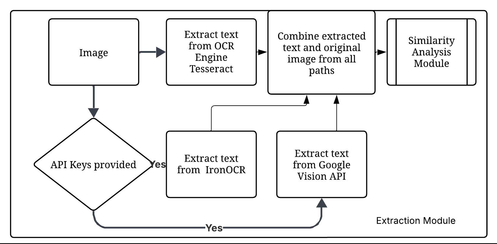
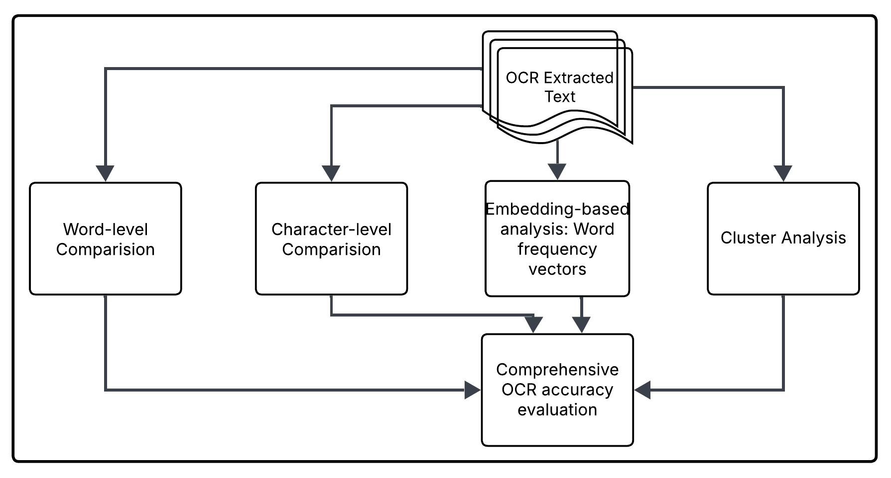
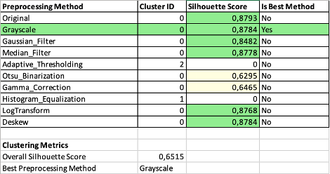
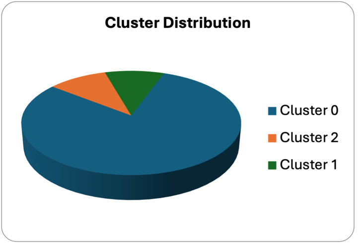
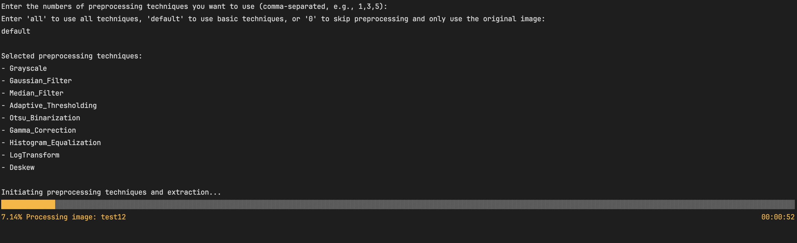

# ML 24/25-10 Creating Text from images with OCR API

The OCR Application Suite is a comprehensive solution for extracting and analyzing text from images. Built with advanced image preprocessing techniques and sophisticated text analysis algorithms, this suite aims to provide synthetic ground truth through majority voting approach and visualise the comparision results.

The application is designed for researchers, data scientists, and professionals who need to extract text from images with high accuracy, especially in scenarios where traditional OCR solutions struggle, such as with poor quality images, diverse fonts, or mixed languages.

<a name="top"></a>

## Table of Contents
1. [Goal of the Experiment](#goal-of-the-experiment)
2. [Features](#features)
3. [Components](#components)
   - [ocrApplication](#ocrapplication)
   - [ocrGui](#ocrgui)
   - [unitTestProject](#unittestproject)
4. [System Requirements](#system-requirements)
5. [Dependencies](#dependencies)
6. [Installation](#installation)
   - [Prerequisites](#prerequisites)
   - [Setup Steps](#setup-steps)
   - [Configuration](#configuration)
   - [Language Data Files](#language-data-files)
7. [Usage](#usage)
   - [Command Line Interface](#command-line-interface)
   - [Graphical User Interface](#graphical-user-interface)
8. [Testing](#testing)
9. [Architecture](#architecture)
   - [ocrApplication](#ocrapplication-1)
      - [Input Handling](#input-handling)
      - [Image Preprocessing](#image-preprocessing)
      - [OCR Extraction](#ocr-extraction)
      - [Similarity Analysis](#similarity-analysis)
      - [Visualization](#visualization)
   - [ocrGui](#ocrgui)
      - [App.axaml](#appaxaml)
      - [Main Window](#main-window)
10. [Result and Visualization](#result-and-visualization)


## Goal of the Experiment
The goal of this experiment is to evaluate and optimize the effectiveness of various image preprocessing techniques on the accuracy of Optical Character Recognition (OCR) using the Terrasect SDK. Specifically, this experiment seeks to achieve the following objectives:

1. **Investigate the Impact of Preprocessing**  
   Assess how different image preprocessing transformations such as shifting, rotating, scaling, contrast adjustments, and noise reduction affect the quality of the extracted text from diverse images, including those with varying quality, lighting conditions, and angles.

2. **Optimize OCR Accuracy**  
   Utilize the Terrasect API to extract text from preprocessed images and determine which preprocessing methods yield the most accurate and reliable text extraction.

3. **Evaluate Preprocessing Strategies**  
   Compare the effectiveness of various preprocessing techniques using metrics like cosine similarity, Levenshtein distance, and clustering analysis to identify the preprocessing approach that best improves the OCR output.

4. **Develop a Robust OCR Solution**  
   Design a console application that loads images, applies preprocessing techniques, extracts text using Terrasect, and outputs both the extracted text and a comparative analysis of the OCR results from different preprocessing approaches.

Ultimately, the experiment aims to enhance OCR capabilities and provide a comprehensive understanding of the role of preprocessing in improving OCR outcomes.

## Features

- **Advanced Image Preprocessing**: 24 different preprocessing techniques to optimize images for OCR
- **Multiple OCR Engines**: Integration with Tesseract, Google Cloud Vision, and IronOCR
- **Synthetic Ground Truth**: Combines results from different preprocessing methods and OCR engines through ensemble approach
- **Text Similarity Analysis**: Compares OCR outputs using multiple similarity metrics
- **Performance Tracking**: Detailed execution time logging and performance benchmarking
- **Comprehensive Reporting**: Generates detailed Excel reports with visualizations
- **User-Friendly GUI**: Intuitive interface for easy interaction and result visualization
- **Cross-Platform Compatibility**: Works on Windows and macOS

## Components

### ocrApplication

The core OCR processing engine that handles:
- Image preprocessing
- OCR extraction
- Ensemble combination
- Text similarity analysis
- Result export

### ocrGui

A graphical user interface built with Avalonia UI that provides:
- Intuitive file selection
- Real-time processing feedback
- Interactive result visualization
- Export capabilities

### unitTestProject

A comprehensive test suite that ensures:
- Code reliability
- Processing accuracy
- Performance benchmarking
- Component integration

## System Requirements

- **Operating System**: Windows 10+ or macOS 10.15+
- **Processor**: Multi-core processor recommended
- **Memory**: 8GB RAM minimum, 16GB recommended
- **Storage**: 2GB for installation, additional space for processing
- **Dependencies**: .NET 8.0 SDK and runtime

## Dependencies
See the [requirements.json](assets/requirements.json) file for a detailed list of dependencies.

## Installation

### Prerequisites

1. **Install .NET 8.0 SDK and Runtime**:
   - Download from [Microsoft .NET Website](https://dotnet.microsoft.com/download/dotnet/8.0)

2. **Install Tesseract OCR**:
   - **macOS**:
     ```bash
     brew install tesseract
     ```
   - **Windows**:
     Nuget package provided along with the solution

3. **Optional API Keys**:
   - **IronOCR License Key**: Required only if using IronOCR features
   - **Google Vision API Key**: Required only if using Google Vision API features
   - **LLM Model Access**: Required only if using advanced text analysis features
     - API URL for your preferred LLM model service
     - Authentication credentials if required by the LLM service
     - Sufficient API quota/credits for processing text
   - These can be configured in the config.json file as described in the Configuration section

### Setup Steps

1. **Clone the repository**:
   ```bash
   git clone https://github.com/yourusername/ocrApplication.git
   cd ocrApplication
   ```

2. **Restore dependencies**:
   ```bash
   dotnet restore
   ```

3. **Build the solution**:
   ```bash
   dotnet build
   ```

### Configuration

Create or modify the `config.json` file in the root directory with the following structure:

```json
{
   "TesseractPath": "YOUR_TESSERACT_PATH",
   "TesseractTessDataPath": "YOUR_TESSDATA_PATH",
   "IronOcrLicenseKey": "YOUR_API_KEY",
   "GoogleVisionApiKey": "YOUR_API_KEY",
   "ApiUrl": "YOUR_LLM_API_URL"
}
```

The configuration parameters are:
- **TesseractPath**: Path to Tesseract executable (required)
- **TesseractTessDataPath**: Path to Tesseract language data files (required)
- **IronOcrLicenseKey**: License key for IronOCR (optional)
- **GoogleVisionApiKey**: API key for Google Cloud Vision (optional)
- **ApiUrl**: URL endpoint for LLM API service (optional, used for advanced text analysis)

### Language Data Files:
Extract the `tessdata.zip` file from the assets folder to the appropriate location as specified in your config.json.

## Usage

### Command Line Interface

Run the OCR application in command-line mode:

```bash
cd ocrApplication
dotnet run -- --input "/path/to/images" --output "/path/to/results" --methods "1,3,5,7"
```
#### Parameters:

- `--input`: Directory containing images to process
- `--output`: Directory to save results
- `--methods`: Comma-separated list of preprocessing method IDs (optional)

Example Usage
```bash
cd ocrApplication
dotnet run "/path/to/images" "/path/to/results" "1,3,5,7,9,11,13,15"
```

### Graphical User Interface

Run the OCR application with GUI:

```bash
cd ocrGui
dotnet run
```

1. Select input folder containing images
2. Select output folder for results
3. Choose preprocessing methods
4. Click "Extraxt Text" to start OCR
5. View results and visualizations
6. Export data as needed

## Testing

The application includes a comprehensive test suite to ensure reliability and accuracy:

```bash
cd unitTestProject
dotnet test
```

## Architecture
The flow diagram of the application is provided below:


This diagram illustrates the complete workflow of the OCR application, showing how image input is processed through preprocessing modules, fed into OCR engines, and how the extracted text results are analyzed, compared and visualized. The diagram shows data flow between components including input handling, image preprocessing, OCR extraction, text similarity analysis, and result export modules.

### ocrApplication
The core OCR processing engine consists of the following key components:

#### Input Handling

The [`InputHandler`](ocrApplication/InputHandler.cs) class manages the first stage of the OCR pipeline as shown in the architecture diagram. It's responsible for loading images from specified locations, creating output directories, and loading selected preprocessing techniques. This component serves as the entry point for all data into the system.

```csharp
public static class InputHandler
{
    // Prompts the user for a valid folder path, ensuring that the input is not empty or whitespace.
    public static string GetFolderPath(string promptMessage) { /* ... */ }
    
    // Discovers all image files in a specified folder and its subfolders.
    public static string[] DiscoverImageFiles(string inputFolderPath)  { /* ... */ }
    
    // Prompts the user to select preprocessing methods to apply from the available options.
    public static List<(string Name, Func<string, Mat> Method)> SelectPreprocessingMethods(
            (string Name, Func<string, Mat> Method)[] allPreprocessMethods)  { /* ... */ }
    
}
```

The InputHandler class is responsible for managing user inputs, processing file directories, and applying preprocessing techniques to images before performing Optical Character Recognition (OCR). Below are the key methods in the class:

**GetFolderPath**
This method ensures that the user inputs a valid path to a folder containing image files. It validates whether the provided path exists and checks if it contains the appropriate image files. If the path is invalid or inaccessible, the method prompts the user to provide a correct one, ensuring that further processing only occurs with valid input.

**DiscoverImageFiles**
This method scans a specified directory to discover all image files in supported formats (e.g., .jpg, .png, .tiff). It allows the program to gather and list all images in the directory, which will be processed for OCR. This is helpful for batch processing when dealing with multiple images in a folder.

**SelectPreprocessingMethods**
Before applying OCR, it is important to enhance the image quality for better recognition accuracy. This method enables users to choose from a list of preprocessing techniques (e.g., noise reduction, resizing, contrast enhancement) to apply to the images. By offering flexibility in preprocessing, this method ensures that users can optimize image quality according to their specific needs, improving the overall OCR results.

#### Image Preprocessing

The [`ImagePreprocessing`](ocrApplication/ImagePreprocessing.cs) class implements the preprocessing module shown in the architecture diagram. This critical component applies various image enhancement techniques to improve OCR accuracy by normalizing image quality, removing artifacts, and enhancing text features before OCR processing.

The image processing module architecture is described below:


The preprocessing module addresses various image quality challenges that can impact OCR accuracy. It implements 24 distinct image enhancement techniques, organized into five functional categories:

- **Noise Reduction**: Techniques to reduce noise and improve image clarity, including Gaussian filtering, median filtering, and bilateral filtering.

- **Binarization: Methods** to convert images to binary form, such as Otsu's method and adaptive thresholding.

- **Geometric Transformations**: Image adjustments like deskewing, rotation, and scaling to correct distortions.

- **Morphological Operations**: Operations to refine image structure, including dilation, erosion, opening, closing, gradient, top-hat, and black-hat.

- **Intensity Adjustments**: Enhancements to image intensity, including gamma correction, histogram equalization, contrast stretching, and brightness reduction.

These techniques are designed to optimize image quality, improving OCR performance and accuracy.


#### OCR Integration Engine

The extraction module containg various OCR Engines is described as follows

This component utilizes a multi-engine strategy for text extraction, offering flexibility and improved accuracy through the following integrations:

**Tesseract OCR**: A locally-running OCR engine that supports a wide range of languages, providing an offline solution for text extraction.

**Google Cloud Vision API**: A cloud-based OCR service with advanced recognition capabilities, leveraging Google's powerful machine learning models for improved accuracy.

**IronOCR**: A powerful OCR library for .NET, providing fast and accurate text extraction from images and PDFs with support for multiple languages.

The system allows users to compare results from all three OCR engines, leveraging an ensemble approach to generate more accurate synthetic ground truth data.

*Note: The integration for IronOCR and Google Cloud Vision API is currently commented out. Once the appropriate API keys are provided, the relevant sections of the code can be uncommented to enable these engines.*

The [`OcrExtractionTools`](ocrApplication/OcrExtractionTools.cs) class represents the OCR engine integration component in the architecture diagram. This module interfaces with multiple OCR engines to extract text from preprocessed images.

```csharp
public class OcrExtractionTools
{
    // Extract text using Tesseract
    public string ExtractTextWithTesseract(string imagePath) { /* ... */ }
    
    // Extract text using Tesseract Nuget Package
    public async Task<string> ExtractTextWithTesseractNuget(string imagePath) { /* ... */ }

    // Extracts text using IronOCR commercial library.
    public string ExtractTextUsingIronOcr(string imagePath) { /* ... */}

   // Extracts text using Google Cloud Vision API.
   public async Task<string> ExtractTextUsingGoogleVisionAsync(string imagePath) { /* ... */}
}
```

#### Similarity Analysis

The text comparision and similarity module archuitecture is described below:


The [`TextSimilarity`](ocrApplication/OcrComparision.cs) class provides a set of methods for comparing and analyzing the similarity between two text strings. It implements several text comparison techniques, each of which calculates similarity based on different algorithms. The class includes the following methods:

```csharp
public class OcrComparison
{
    // Calculates Levenshtein similarity
    public double CalculateLevenshteinSimilarity(string text1, string text2) { /* ... */ }
    
    // Calculates cosine similarity
    public double CalculateCosineSimilarity(string text1, string text2) { /* ... */ }
    
    // Generate word vectors for comparison
    public Dictionary<string, double> GetWordVector(string text) { /* ... */ }

    // Calculates Jaccard similarity
    public float CalculateJaccardSimilarity(string text1, string text2)
        { /* ... */ }

    // Calculates Jaro-Winkler similarity
    public float CalculateJaroSimilarity(string s1, string s2)
        { /* ... */ }
}
```

The Similarity Analysis Module leverages multiple text similarity metrics and embedding techniques to evaluate OCR accuracy comprehensively. This module allows for a detailed comparison of OCR outputs, ensuring the system can assess recognition quality from various perspectives. The following metrics and techniques are implemented:

**Character-level metrics**

- Levenshtein Distance: Measures the minimum number of character edits (insertions, deletions, substitutions) required to transform one string into another.

- Jaro-Winkler Similarity: A string comparison algorithm that focuses on matching characters while accounting for transpositions.

**Word-level metrics**

- Cosine Similarity: Measures the cosine of the angle between two word vectors, useful for comparing documents based on word frequency distributions.

- Jaccard Similarity: Calculates the ratio of the intersection over the union of two sets (e.g., sets of words), assessing the overlap between texts.

**Embedding-based analysis**

Word Frequency Vectors: Represents each word in a text as a vector, with the frequency of occurrence providing weight.

**Cluster-based analysis**

This technique extracts features from images (e.g., visual characteristics) and groups similar images into clusters. This is useful for identifying patterns, organizing OCR outputs, and grouping similar documents or pages.

**Visual Characteristics for Feature Extraction**

The following visual attributes are extracted to assess OCR accuracy:

1) Intensity Distribution: Mean and standard deviation of pixel intensities.
2) Edge Density: Quantified using Canny edge detection.
3) Aspect Ratio and Normalized Dimensions: Shape characteristics to detect distortions.
4) Noise Characteristics: Evaluated using local variance analysis.
5) Contrast Levels: Measured through histogram analysis and contrast stretch ratios.

These techniques combine to form a robust analysis toolkit for comparing OCR results and generating a more accurate evaluation of OCR accuracy and quality.


#### Visualization

The Visualization Module as described in the below figure is designed to provide visual representations of text similarity and facilitate the export of OCR results for reporting and analysis. 


This module includes the following key classes and methods:

**SimilarityMatrixGenerator Class**

The [`SimilarityMatrixGenerator`](ocrApplication/TextSimilarity.cs) class creates visual representations of text similarity:

```csharp
public class SimilarityMatrixGenerator
{
    // Generate text embeddings for visualization
    public List<TextEmbedding> GenerateTextEmbeddings(List<string> texts, List<string> labels) { /* ... */ }
    
    // Create similarity heatmap
    public async Task GenerateAndVisualizeOcrSimilarityMatrix(
        List<string> ocrResults, 
        string groundTruth, 
        string outputFilePath, 
        List<string> ocrSteps) { /* ... */ }
}
```

The SimilarityMatrixGenerator class is responsible for creating visual representations of text similarity. It generates embeddings and visualizes similarity metrics to help analyze and compare OCR outputs against the ground truth. The key methods in this class are:

1) GenerateTextEmbeddings: This method generates text embeddings for a given list of texts, which are used for visualizing the similarity between different text entries. The embeddings are accompanied by corresponding labels, making it easier to interpret the results.
2) GenerateAndVisualizeOcrSimilarityMatrix: This asynchronous method creates a similarity heatmap by comparing OCR results with the ground truth. It visualizes the degree of similarity between OCR outputs and provides a useful way to assess how well different OCR results match the expected text. The heatmap is saved as an excel file at the specified outputFilePath.

These methods help in generating a visual matrix that allows for easy comparison and analysis of OCR accuracy.

**Export Utilities**

The [`ExportUtilities`](ocrApplication/ExportUtilities.cs) class provides functionality for exporting synthetic ground truth text and OCR results in multiple file formats. This allows users to save and share their results for further analysis or reporting. The key method in this class is:

```csharp
public static class ExportUtilities
{
   // Exports complete OCR results to multiple file formats, including best methods summaries.
   public static void ExportResults(
               string outputPath, 
               ConcurrentDictionary<string, string> extractedTexts,
               ConcurrentDictionary<string, string> bestCosineMethods,
               ConcurrentDictionary<string, string> bestLevenshteinMethods,
               ConcurrentDictionary<string, string> bestClusteringMethods,
               Dictionary<string, string> overallBestMethods){ /* ... */ }
}
        
```

ExportResults: This method exports the complete OCR results to various file formats, including .txt and .pdf. It allows for the export of OCR outputs along with method summaries, such as:

1) Best Cosine Methods: Best OCR methods based on cosine similarity.
2) Best Levenshtein Methods: Best OCR methods based on Levenshtein distance.
3) Best Clustering Methods: Best methods based on clustering results.
4) Overall Best Methods: A summary of the overall best-performing OCR methods.

Key methods:

- **ExportToPlainText**: Exports OCR text to a .txt file.
- **ExportToPdf**: Exports OCR text to a formatted PDF.
- **ExportBestMethodsSummary**: Exports a detailed analysis of the best methods to text, PDF, and Excel.

By utilizing this method, users can export results and summaries of their OCR comparison to share, review, or document their findings.

### ocrGui

OCRGui is a graphical user interface designed to facilitate Optical Character Recognition (OCR) tasks by interacting with the underlying ocrApplication. It allows users to provide necessary inputs, validate them, and process them through OCR. The results are then displayed, or users are prompted to correct any errors.

The following flowchart describes the workflow of ocrGui, a graphical user interface (GUI) designed for handling OCR (Optical Character Recognition) processing by interacting with an underlying ocrApplication.


*This diagram shows the GUI component workflow, illustrating how user interactions are processed through the Avalonia UI framework. It demonstrates the flow from user input capture, through the MVVM architecture components, to the rendering of results and visualizations in the interface.*

**Key Components**

- **ocrGui**: The user interface where users interact with the OCR system. It captures input, displays error messages, and presents the final OCR results.

- **User Input**: The user provides inputs such as file selection, OCR settings, and preprocessing options to initiate the OCR task.

- **Input Validation**: OCRGui checks whether the user inputs are valid. If valid, it transforms the inputs into commands that ocrApplication can process. If invalid, an error message prompts the user to correct the inputs.

- **ocrApplication**: The underlying application that performs the actual OCR task. It receives commands from OCRGui and processes them to extract text from the provided files.

- **Error Handling**: In case of an execution error, OCRGui displays a detailed error message to help users identify and correct the issue.

- **Result Display**: After a successful OCR execution, OCRGui shows the results. If an error occurs, users are guided to fix the inputs and retry the process.

In the .NET MAUI application, the main page and window are crucial for user interaction. This section provides an overview of how the main page and window are configured in the application.

#### App.axaml

The App.xaml file is the entry point of the application, which defines the primary page and initializes the application resources. In Avalonia, the first page presented when running the app is defined in this file. It holds the configuration for the main application window, making it central to window management and lifecycle. Below is the code responsible for setting up the application:
```csharp
public class App : Application
{
   // Initializes the application by loading XAML resources.
    public override void Initialize()
        {
            AvaloniaXamlLoader.Load(this);
        }

   // This is where we create the main window instance and assign it to the desktop application lifetime. This ensures proper window management and lifecycle.
   public override void OnFrameworkInitializationCompleted()
        {
            if (ApplicationLifetime is IClassicDesktopStyleApplicationLifetime desktop)
            {
                // Create the main window for the application
                desktop.MainWindow = new MainWindow();
            }

            base.OnFrameworkInitializationCompleted();
        }
}
```

- **Initialize()**: This method loads the XAML resources required for the application. It prepares the UI and resources, like styles and themes, that are defined in XAML.

- **OnFrameworkInitializationCompleted()**: This method runs when the application is initialized. It checks if the application is running in a desktop environment (IClassicDesktopStyleApplicationLifetime) and assigns the main window (MainWindow) to the desktop application. This ensures the main window is managed properly and is the first window users see.

#### Main Window

The [`MainWindow.axaml.cs`](ocrGui/MainWindow.axaml.cs) file is where the main window of the application is created and configured. It contains the code that sets up the window instance, handles UI interactions, and ensures proper initialization of the window during the application's lifetime.
```csharp
public partial class MainWindow : Window
{
   // This is where we create the main window instance and assign it to the desktop application lifetime. This ensures proper window management and lifecycle.
   public MainWindow(){ /*  ... */ }
}
```

- MainWindow(): The constructor for the MainWindow class initializes the window's components and performs any necessary configuration. This is where any window-specific settings, such as title, size, or content layout, can be set up.

To summarise the working of GUI Application

- **App.axaml** initializes the application, loading resources and defining the primary page.

- **OnFrameworkInitializationCompleted()** assigns the main window to the desktop application, ensuring proper window management.

- **MainWindow.axaml.cs** is where the main application window is configured, providing the user interface for interacting with the app.

## Result and Visualization

### Similarity Metrics


This image shows a tabular representation of similarity scores across different preprocessing methods. Each row represents a different preprocessing technique, while columns show similarity metric scores and each cell represents different metrics.


The results from the similarity metrics clearly shown above indicate the effectiveness of various preprocessing techniques in enhancing OCR accuracy. Higher similarity scores, closer to 1.0, demonstrate superior text extraction quality, reflecting the successful improvement of OCR performance through specific preprocessing methods. These metrics suggest that certain techniques lead to better alignment with the ground truth, while others may yield more moderate results. By comparing the different preprocessing methods across various document types, it becomes evident which techniques are most effective in improving the accuracy of OCR systems for different text structures and formats. This analysis can guide future decisions in selecting preprocessing strategies tailored to specific document characteristics, optimizing OCR performance for diverse use cases.

### Performance Visualization


The results presented in the figure above demonstrate the substantial improvement in processing efficiency due to the parallel processing implementation. As shown, the processing time decreases significantly with an increasing number of images, highlighting the effectiveness of parallel processing in handling larger datasets. The speedup factor of nearly 4.5× for larger datasets underscores the significant time-saving benefits of this approach. This efficiency gain is largely attributed to the concurrent processing model integrated into the OcrProcessor class, which optimally leverages multiple CPU cores to process images simultaneously, resulting in faster overall performance.

### Embedding Analysis

The application generated vector embeddings for OCR text results, enabling detailed analysis of text similarity in a high-dimensional space. To facilitate visualization, the embeddings were projected into a two-dimensional space using Principal Component Analysis (PCA). 

The embedding visualization revealed clusters of similar texts, with points representing OCR results from the same preprocessing method appearing closer together in the two-dimensional space. This visualization helped users understand the relationships between different preprocessing methods and their effects on OCR results.


The embedding analysis revealed several key insights:

1. **Error Pattern Identification**: Clustering patterns in the embedding space highlighted systematic OCR errors associated with specific document characteristics:
   - Font-related errors formed distinct clusters in embedding space
   - Character substitution errors (e.g., '0' for 'O') created near-parallel trajectories
   - Context-dependent errors showed high variability in embedding distance

2. **Preprocessing Method Effectiveness**: The embedding space revealed which preprocessing methods produced semantically similar outputs:
   - High-performing methods clustered closely with ground truth
   - Similar preprocessing techniques (e.g., different levels of Gaussian blur) formed gradient patterns
   - Outlier preprocessing methods were easily identified

3. **Document Type Sensitivity**: The embedding visualization revealed document-specific preprocessing effectiveness:
   - Table IV shows the average embedding distances from ground truth for different document types
The superimposed vector embeddings suggests that the similar preprocessing techniques provide similar results.

### Cluster Analysis

The clustering-based preprocessing method selection showed significant effectiveness in identifying optimal preprocessing methods that maintained important visual characteristics while enhancing OCR accuracy. Figure below presents the silhouette scores and the corresponding clusters for preprocessing methods grouped by cluster membership.

 

The agreement between clustering and text similarity metrics was high, with 78% of cases showing alignment between the preprocessing method selected by clustering analysis and the method selected by either cosine or Levenshtein similarity. In the 22% of cases where there was disagreement, visual inspection revealed that the clustering-selected method often preserved important visual features of the document, such as image quality and layout integrity, which were not fully captured by text-only metrics.

### Overall Summary

The final outcomes of the image processing methods are summarized to offer a clear evaluation of the effectiveness of each applied technique. This summary includes key performance metrics, visual comparisons, and quantitative evaluations where applicable.

Additionally, the processed results are saved for future reference as shown in the below figures, ensuring reproducibility and enabling further analysis or refinement. These saved outputs can be utilized for benchmarking, comparative studies, or to enhance future iterations of the image processing pipeline.


### User Interface 

The application provides two modes of interaction for users: the Command Line Interface (CLI) and the Graphical User Interface (GUI). Both interfaces allow users to specify input folders, process images using OCR techniques, and view or save the extracted text. The choice of interface depends on user preference and the desired level of interaction, with the CLI offering a streamlined, text-based approach and the GUI providing a more visual, user-friendly experience. Each interface is designed to ensure smooth processing and efficient access to OCR results.

**Command Line Interface Screen**

In the CLI version, users specify folder names by entering paths as command-line arguments or providing inputs interactively. The application then processes the images within the specified folders, extracting text using OCR techniques.

During the processing, a progress bar is shown to keep the user updated on the current status and estimated completion time. Once the processing is complete, the extracted text is displayed in the terminal for immediate review. Additionally, users have the option to save the results to a file for future reference, ensuring easy access for further analysis or follow-up actions.



**Graphical User Interface Screen**

 

The user inputs the folder names through the GUI, either by typing the path or selecting folders via a browse dialog. Once the folders are specified, the application processes the images and extracts text using OCR techniques. After processing is complete, the extracted text is displayed directly in the GUI, allowing the user to review the results. Users can easily save the extracted text to a file for future reference or further analysis. Additionally, the interface provides an intuitive and user-friendly experience, ensuring smooth navigation and efficient access to the OCR results.

[⬆️ Back to Top](#top)
